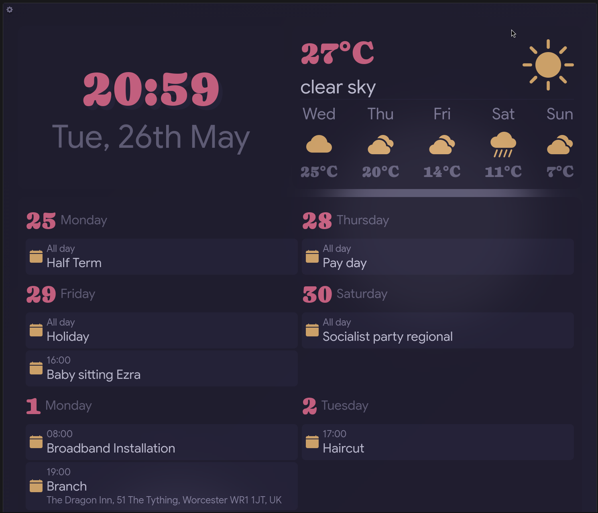
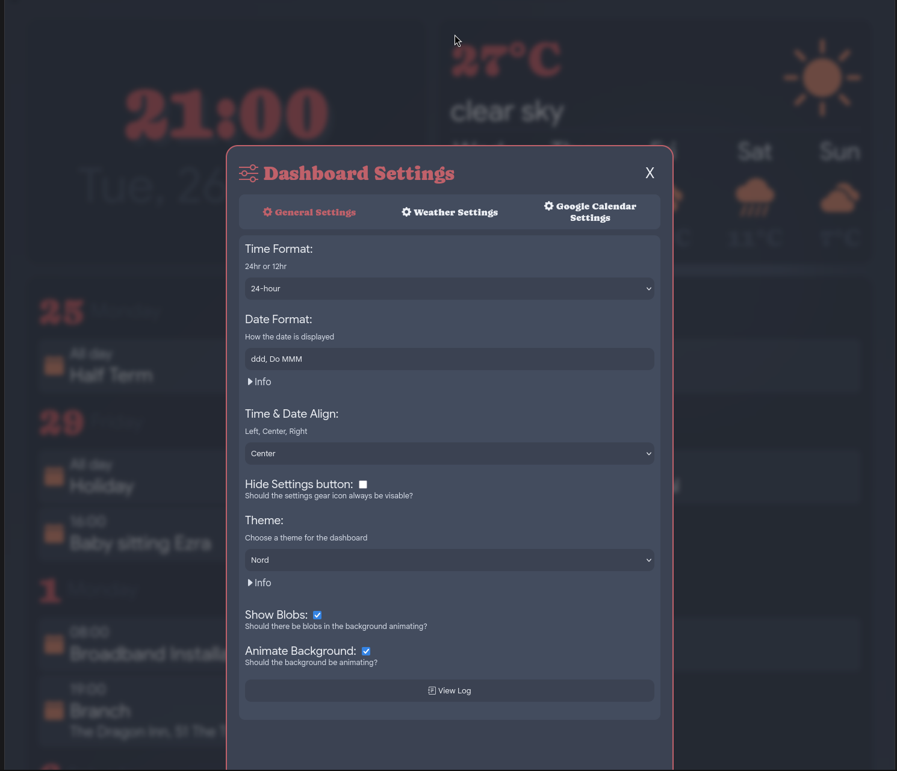

# Simply-Dash
Simply-Dash is a web-based dashboard for displaying the Time, Date, Weather and Google Calendar Events. It's designed to be lightweight, customisable, and easy to self-host — perfect for a personal home screen or always-on display.




## Prerequisites
- Python 3 (or any web server of your choice)
- A modern web browser
- An OpenWeatherMap account (for weather)
- A Google Cloud account (for Google Calendar)

## Running
You can ultimately use whatever web server you want, but Python is recommended:
```
cd ~/Simply-Dash && python3 -m http.server 3000
```

## Features
### Date
Enter a custom date format to have the date display exactly how you want.

### Weather
Weather uses OpenWeatherMap as the weather provider. See the section below on how to obtain your own API key.

### Google Calendar
Display upcoming events from your Google Calendar.

## Settings
### General Settings
- **Time Format:** (Default: 24hr)
    - Change the time format between 24hr and 12hr (am/pm).
- **Date Format:** (Default: ddd, Do MMM)
    - Set the date format based on date format codes.
    - Reference: [DevHints](https://devhints.io/datetime)
- **Hide the Settings Button:** (Default: false)
    - At the top left of the screen is a gear icon used to access the settings. Toggling this setting will toggle the visibility of the icon.
- **Theme:** (Default: RosePine)
    - Allows you to change between 5 built-in themes. If you don't like any of them, you can edit the JS file directly.
        - RosePine
        - Catppuccin
        - Everforest
        - Gruvbox
        - Nord

### Weather Settings
- **Units:** (Default: Celsius (°C))
    - Switch between Celsius (°C) and Fahrenheit (°F).
- **Location:**
    - Enter the location where you want to track the weather.
- **Weather API Key:**
    - Your OpenWeatherMap API key goes here. See the 'Getting API Keys' section.
- **API Request Timer:** (Default: 20)
    - An API request will be made once every X minutes.
    - Note: This is limited based on your OpenWeatherMap API plan. [OpenWeatherMap Pricing](https://openweathermap.org/full-price)
- **Forecast Days:** (Default: 3)
    - How many forecast days to display.

### Google Calendar Settings
- **Google Client ID:**
    - Your OAuth client ID goes here. See the 'Getting API Keys' section.
- **Google Client Secret:**
    - Your OAuth client secret goes here. See the 'Getting API Keys' section.
- **API Request Timer:** (Default: 10)
    - An API request will be made once every X minutes.
- **Calendars:**
    - **Get Calendars** — Fetches the calendars linked to your account.
    - **Checkbox** — Toggle to show or hide each calendar's events.
    - **Icon** — Display an icon of your choice for each calendar.
        - To find an icon, visit the link below, search for one and click on it. Under 'Icon Font', copy just the `bi-icon-name` part and paste it into the icon textbox. [Bootstrap Icons](https://icons.getbootstrap.com/)
- **Max Events:** (Default: 10)
    - The maximum number of events to display.
- **Maximum Number of Days:** (Default: 10)
    - The maximum number of days ahead to display events for.
- **Refresh Now**
    - Sync with Google Calendar immediately to fetch any recent changes.

## Getting API Keys
### Weather
To get an OpenWeatherMap API key:
- Go to: [OpenWeatherMap](https://openweathermap.org/)
- Create an account
- Select your account name at the top right
    - Select 'My API keys'
- Copy your API key somewhere safe.

### Google Calendar
To get Google Calendar working you need two things:
- Client ID
- Client Secret

#### Step 1 — Set Up a Google Cloud Project
- Visit [Google Cloud Console](https://console.cloud.google.com/) and log in with your Google account of choice.
- Create a new project and select it.

#### Step 2 — Enable Google Calendar API
- Open the menu (left of 'Google Cloud'):
    - APIs and Services → Library
    - Search for **Google Calendar API** and select it.
    - Click **Enable**.

#### Step 3 — Create your OAuth Consent Screen
- Open the menu:
    - APIs and Services → OAuth Consent Screen
        - Click **Get Started**:
            - **App Info:** Enter any app name and your support email.
            - **Audience:** Select **External**.
            - **Contact Info:** Enter your email again.
            - Click **Finish**, agree to the terms, then click **Create**.

#### Step 4 — Create your OAuth Client
- Open the menu:
    - APIs and Services → OAuth Consent Screen → Clients
        - Click **Create Client**:
            - **Application Type:** Web App
            - **Name:** Anything you like
            - **Authorised JavaScript Origins:** Leave blank
            - **Authorised Redirect URIs:** `http://localhost:3000/callback.html`
            - Click **Create**

> ⚠️ **Important:** Copy both of the following to somewhere safe before closing this window:
> - **Client ID**
> - **Client Secret**

#### Step 5 — Add your Account as a Test User
- Open the menu:
    - APIs and Services → OAuth Consent Screen → Audience → Test Users
        - Click **Add** and enter the email address of the Google account whose calendar you want to access.

## Maybe one day...
- Support for other calendars: Icalendar, caldav, etc
- Change how events are displayed — possibly using a grid-based layout.
- More customisation options for end users.
- Tab-based settings modal.
- Background behind content.
- Custom CSS inputs.

## Licence
MIT — feel free to use and modify this project as you like.
